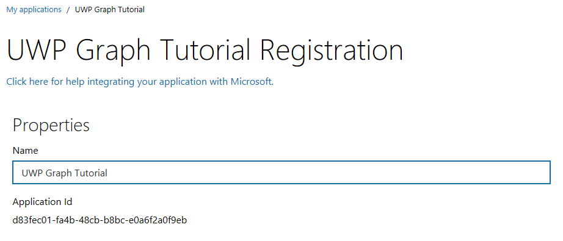
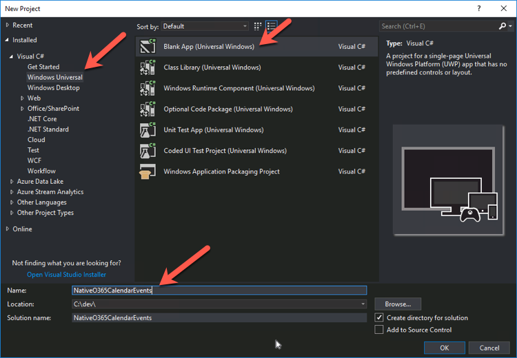
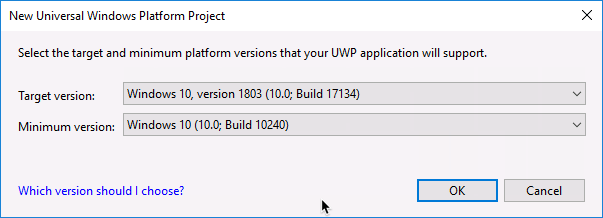
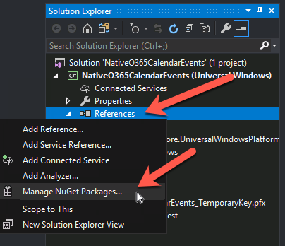
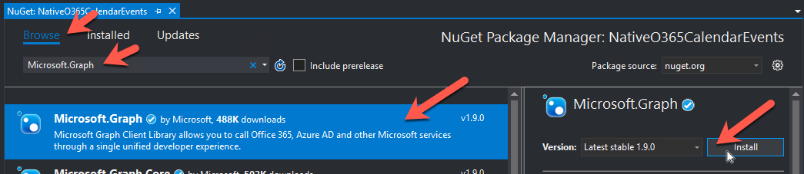
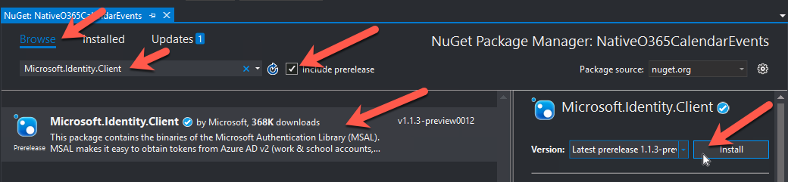
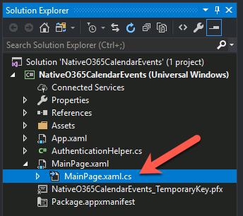
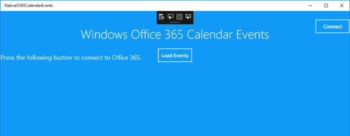
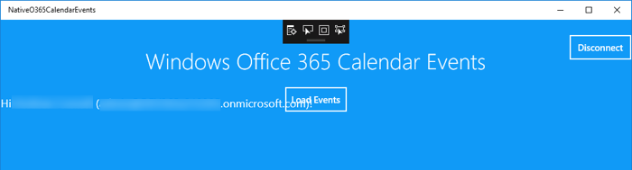
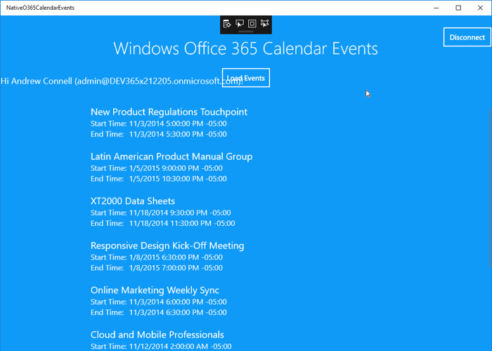

# Build Windows native applications with the Microsoft Graph

In this lab you will create a Universal Windows Platform (UWP) application using the Azure AD v2 authentication endpoint and the Microsoft Authentication Library (MSAL) to access data in Office 365 using the Microsoft Graph.

## In this lab

* [Create an Azure AD native application with the App Registration Portal](#exercise1)
* [Create an UWP native application](#exercise2)
* [Extend the UWP app for Azure AD Authentication](#exercise3)
* [Integrate Microsoft Graph into the Application](#exercise4)

## Prerequisites

To complete this lab, you need the following:

* Office 365 tenancy
  * If you do not have one, you obtain one (for free) by signing up to the [Office 365 Developer Program](https://developer.microsoft.com/en-us/office/dev-program).
* [Visual Studio 2017](https://www.visualstudio.com/vs)

<a name="exercise1"></a>

## Exercise 1: Create an Azure AD native application with the App Registration Portal

In this exercise you will create a new Azure AD native application using the App Registry Portal (ARP).

1. Open a browser and navigate to the **App Registry Portal**: **apps.dev.microsoft.com** and login using a **personal account** (aka: Microsoft Account) or **Work or School Account**.
1. Select **Add an app** at the top of the page.
1. On the **Register your application** page, set the **Application Name** to **NativeO365CalendarEvents** and select **Create**.

    

1. On the **NativeO365CalendarEvents Registration** page, under the **Properties** section, copy the **Application Id** Guid as you will need it later.

    

1. Scroll down to the **Platforms** section.

    1. Select **Add Platform**.
    1. In the **Add Platform** dialog, select **Native Application**.

        

    1. After the native application platform is created, copy the **Custom Redirect URIs** as you will need it later.

        

        > Unlike application secrets that are only displayed a single time when they are created, the custom redirect URIs are always shown so you can come back and get this string if you need it later.

1. In the **Microsoft Graph Permissions** section, select **Add** next to the **Delegated Permissions** subsection.

    

    In the **Select Permission** dialog, locate and select the permission **Calendars.Read** and select **OK**:

      

      

1. Scroll to the bottom of the page and select **Save**.

<a name="exercise2"></a>

## Exercise 2: Create a UWP application

1. Open Visual Studio 2017.
1. In Visual Studio, select **File > New > Project**.
1. In the **New Project** dialog, do the following:
    1. Select **Templates > Windows Universal**.
    1. Select **Blank App (Universal Windows)**.
    1. Enter **NativeO365CalendarEvents** for the **Name** of the project.

          

    1. In the **New Universal Windows Platform Project** dialog, you can select anything you like as nothing in this lab depends on specific Windows features.

        Select **OK** after specifying your desired **Target version** & **Minimum version**.

        

1. Add the necessary NuGet Packages to the project:
    1. In the **Solution Explorer** tool window, right-click the **References** node and select **Manage NuGet Packages...**:

        

    1. Add the Microsoft Graph .NET SDK to the project:
        1. Select the **Browse** tab and enter **Microsoft Graph** in the search box. 
        1. Select the **Microsoft.Graph** client in the results.
        1. Select **Install** to install the package.

            

            If prompted, accept all licenses.

    1. Add the Microsoft Authentication Library (MSAL) Preview to the project:
        1. Select the **Browse** tab and enter **Microsoft.Identity.Client** in the search box.
        1. Select the **Include Prerelease** checkbox to include libraries currently in preview.

            > MSAL is currently in preview at the time of writing.

        1. Select the **Microsoft.Identity.Client** client in the results.
        1. Select **Install** to install the package.

            

            If prompted, accept all licenses.

### Create the Application User Interface

The first step is to create the shell of the user experience; creating a workable storyboard.

1. Open the **MainPage.xaml** file.
1. Replace the empty `<Grid></Grid>` XAML element with the following XAML.

    This XAML will create an interface broken into two sections:

      * **Header**:
        * A button to sign in & sign out of your Office 365 account
        * A button to refresh the list of events from your calendar
        * Two (2) text blocks to display the application title and name of the signed in user.
      * **Body**:
        * Progress animation control shown when authenticating with Azure AD & loading events from Office 365 using the Microsoft Graph
        * List control showing events from your calendar

    ```xml
    <Grid Background="{StaticResource ApplicationPageBackgroundThemeBrush}">
      <Grid x:Name="MainGrid">
        <Grid.RowDefinitions>
          <RowDefinition Height="90"/>
          <RowDefinition Height="90"/>
          <RowDefinition Height="*"/>
        </Grid.RowDefinitions>

        <Button Grid.Row="0" x:Name="ConnectButton" HorizontalAlignment="Right" Content="Connect" FontSize="14.667" Click="ConnectButton_Click" Height="40" Width="100" Background="Transparent" FontWeight="SemiBold" Foreground="White" BorderBrush="White"/>
        <TextBlock Grid.Row="1" Grid.Column="1"  x:Name="InfoText" Foreground="White" VerticalAlignment="Center" HorizontalAlignment="Left" FontSize="{ThemeResource TextStyleLargeFontSize}" TextWrapping="Wrap" Width="750" Margin="0,10"/>
        <Button Grid.Row="1" x:Name="ReloadButton"  Margin="0,20,0,0" HorizontalAlignment="Center" VerticalAlignment="Top" Content="Load Events" FontSize="14.667"  Click="ReloadButton_Click" Height="40" Width="100" Background="Transparent" FontWeight="SemiBold" Foreground="White" BorderBrush="White"/>
        <TextBlock x:Name="appTitle" Grid.Row="0" Text="Windows Office 365 Calendar Events" HorizontalAlignment="Center" VerticalAlignment="Bottom" FontSize="36" Style="{StaticResource HeaderTextBlockStyle}" Foreground="White" />

        <ProgressRing x:Name="ProgressBar" Visibility="Collapsed" Grid.Row="2" IsActive="True" Width="50" Height="50" Foreground="White" />
        <ListView x:Name="EventList" AutomationProperties.AutomationId="EventListView" AutomationProperties.Name="Items" TabIndex="1" Grid.Row="2" Margin="50,0,0,0" Padding="120,0,0,60" IsSwipeEnabled="False" SelectionMode="Single">
          <ListView.ItemTemplate>
            <DataTemplate>
              <Grid Margin="6">
                <Grid.ColumnDefinitions>
                  <ColumnDefinition Width="Auto"/>
                  <ColumnDefinition Width="*"/>
                </Grid.ColumnDefinitions>
                <Grid.RowDefinitions>
                  <RowDefinition Height="Auto"/>
                  <RowDefinition Height="Auto"/>
                  <RowDefinition Height="Auto"/>
                  <RowDefinition Height="*"/>
                </Grid.RowDefinitions>

                <StackPanel Grid.Column="1" Grid.Row="1" Margin="0,0,5,0">
                  <TextBlock Style="{StaticResource BodyTextBlockStyle}" Text="{Binding Subject}" TextWrapping="NoWrap" MaxHeight="40"  FontSize="20" Foreground="White"/>
                </StackPanel>

                <StackPanel Grid.Column="1" Grid.Row="2"  Margin="0,0,5,0">
                  <TextBlock Style="{StaticResource BodyTextBlockStyle}" Text="Start Time: " TextWrapping="NoWrap" MaxHeight="40" FontSize="16"  Foreground="White"/>
                </StackPanel>

                <StackPanel Grid.Column="2" Grid.Row="2"  Margin="80,0,5,0">
                  <TextBlock Style="{StaticResource BodyTextBlockStyle}" Text="{Binding Start}" TextWrapping="NoWrap" MaxHeight="40" FontSize="16"  Foreground="White"/>
                </StackPanel>

                <StackPanel Grid.Column="1" Grid.Row="3"  Margin="0,0,5,0">
                  <TextBlock Style="{StaticResource BodyTextBlockStyle}" Text="End Time: " TextWrapping="NoWrap" MaxHeight="40" FontSize="16"  Foreground="White"/>
                </StackPanel>

                <StackPanel Grid.Column="2" Grid.Row="3" Margin="80,0,5,0">
                  <TextBlock Style="{StaticResource BodyTextBlockStyle}" Text="{Binding End}" TextWrapping="NoWrap" MaxHeight="40" FontSize="16"  Foreground="White"/>
                </StackPanel>
              </Grid>
            </DataTemplate>
          </ListView.ItemTemplate>
          <ListView.ItemContainerStyle>
            <Style TargetType="FrameworkElement">
              <Setter Property="Margin" Value="0,0,0,10"/>
            </Style>
          </ListView.ItemContainerStyle>
        </ListView>
      </Grid>

    </Grid>
    ```

<a name="exercise3"></a>

## Exercise 3: Extend the UWP app for Azure AD Authentication

With the application created, now extend it to support authentication with Azure AD. This is required to obtain the necessary OAuth access token to call the Microsoft Graph. In this step you will integrate the Microsoft Authentication Library (MSAL) into the application.

1. Open the **App.xaml** file.
1. Add the following markup to the `<Application>` element. This will specify two formatting options as well as define the application ID and MSAL redirect URLs:

    ```xml
    <Application.Resources>
      <SolidColorBrush x:Key="SampleHeaderBrush" Color="#007ACC" />
      <SolidColorBrush x:Key="ApplicationPageBackgroundThemeBrush" Color="#1799F0" />

      <x:String x:Key="ida:ClientID">ENTER_APP_ID</x:String>
      <x:String x:Key="ida:ReturnUrl">ENTER_APP_CUSTOM_REDIRECT_URI</x:String>
    </Application.Resources>
    ```

1. Update the `ida:ClientID` & `ida:ReturnUrl` values to those you copied when creating a the Azure AD application in [exercise 1 above](#exercise1).
1. Add an authentication helper class:
    1. Right-click the project in the **Solution Explorer** tool window and select **Add > Class**.
    1. Set the **Name** of the class to **AuthenticationHelper.cs** and select **Add**.
    1. In the **AuthenticationHelper.cs** file, add the following `using` statements after the default statements added:

        ```cs
        using System.Net.Http.Headers;
        using Windows.Storage;
        using Microsoft.Identity.Client;
        ```

    1. Update the accessor of the `AuthenticationHelper` class to be public by adding the `public` keyword:

        ```cs
        public class AuthenticationHelper
        ```

    1. Add the following members to the `AuthenticationHelper` class that will be used throughout this class:

        ```cs
        static string clientId = App.Current.Resources["ida:ClientID"].ToString();
        public static string[] Scopes = { "User.Read", "Calendars.Read" };

        public static PublicClientApplication IdentityClientApp = new PublicClientApplication(clientId);

        public static string TokenForUser = null;
        public static DateTimeOffset Expiration;
        public static ApplicationDataContainer _settings = ApplicationData.Current.RoamingSettings;
        ```

    1. Add the following method `GetTokenForUserAsync()` that will start the interactive authentication process with the current user of the application. If the authentication process is successful, the user's name and email address are stored in Windows roaming storage and the token is returned to the caller:

        ```cs
        internal static async Task<string> GetTokenForUserAsync()
        {
          AuthenticationResult authResult;
          try
          {
            authResult = await IdentityClientApp.AcquireTokenSilentAsync(Scopes, IdentityClientApp.Users.First());
            TokenForUser = authResult.AccessToken;

            _settings.Values["userEmail"] = authResult.User.DisplayableId;
            _settings.Values["userName"] = authResult.User.Name;
          }

          catch (Exception)
          {
            if (TokenForUser == null || Expiration <= DateTimeOffset.UtcNow.AddMinutes(5))
            {
              authResult = await IdentityClientApp.AcquireTokenAsync(Scopes);

              TokenForUser = authResult.AccessToken;
              Expiration = authResult.ExpiresOn;

              _settings.Values["userEmail"] = authResult.User.DisplayableId;
              _settings.Values["userName"] = authResult.User.Name;
            }
          }

          return TokenForUser;
        }
        ```

    1. Add the following method `SignOut()` to log the user out:

        ```cs
        public static void SignOut()
        {
          foreach (var user in IdentityClientApp.Users)
          {
            IdentityClientApp.Remove(user);
          }

          TokenForUser = null;

          _settings.Values["userID"] = null;
          _settings.Values["userEmail"] = null;
          _settings.Values["userName"] = null;
        }
        ```

1. Update the application's user interface to leverage the Azure AD authentication code you just added:
    1. In the **Solution Explorer** tool window, expand the **MainPage.xaml** file and double-click the **MainPage.xaml.cs** file:

        

    1. Add the following `using` statements to the end of the existing `using` statements in t he **MainPage.xaml.cs** file:

        ```cs
        using System.Threading.Tasks;
        using Windows.Storage;
        ```

    1. Add the following members to the `MainPage` partial class

        ```cs
        private bool _connected = false;
        private string _emailAddress = null;
        private string _displayName = null;
        public static ApplicationDataContainer _settings = ApplicationData.Current.RoamingSettings;
        ```

    1. Add the following method that will run when the application is initialized:

        ```cs
        protected override void OnNavigatedTo(NavigationEventArgs e)
        {
          if (!App.Current.Resources.ContainsKey("ida:ClientID"))
          {
            InfoText.Text = "Oops - It looks like this app is not registered with Office 365, because we don't see a client id in App.xaml.";
            ConnectButton.IsEnabled = false;
          }
          else
          {
            InfoText.Text = "Press the following button to connect to Office 365.";
            ConnectButton.IsEnabled = true;
          }
        }
        ```

    1. Add the following method that will be used to trigger the authentication process:

        ```cs
        private async Task<bool> SignInCurrentUserAsync()
        {
          var token = await AuthenticationHelper.GetTokenForUserAsync();
          if (token != null)
          {
            Debug.WriteLine("Token: " + token);
            this._emailAddress = (string)_settings.Values["userEmail"];
            this._displayName = (string)_settings.Values["userName"];
            return true;
          }
          else
          {
            return false;
          }
        }
        ```

    1. Add the following method that acts as the event handler when the **Connect** button is pressed. It will start the signin / signout process depending on the current logged in state.

        ```cs
        private async void ConnectButton_Click(object sender, RoutedEventArgs e)
        {
          ProgressBar.Visibility = Visibility.Visible;

          if (!_connected)
          {
            if (await SignInCurrentUserAsync())
            {
              InfoText.Text = "Hi " + _displayName + " (" + _emailAddress + ")!";
              ConnectButton.Content = "Disconnect";
              _connected = true;
            }
            else
            {
              InfoText.Text = "Oops! We couldn't connect to Office 365. Check your debug output for errors.";
            }
          } else
          {
            EventList.ItemsSource = null;
            AuthenticationHelper.SignOut();

            InfoText.Text = "Press the following button to connect to Office 365.";
            ConnectButton.Content = "Connect";

            _connected = false;
          }

          ProgressBar.Visibility = Visibility.Collapsed;
        }
        ```

    1. Add the following method stub that you will implement later. It is used by the button in the UI that will retrieve events from your Office 365 calendar using the Microsoft Graph:

        ```cs
        private async void ReloadButton_Click(object sender, RoutedEventArgs e)
        {
        }
        ```

    1. Test the application by pressing **F5**.

        

    1. After the app loads, press the **Connect** button to initiate the login process:

        

    1. After successfully logging in, you may be prompted to consent to the permissions requested by the application. If prompted, agree to the consent dialog.

    1. After successfully signing in, you will see the application display the current name and email of the signed in user:

        

        Now that the application is working with Azure AD, the next step is to implement the Microsoft Graph integration.

    1. Select the **Disconnect** button in the application and close the application.

<a name="exercise4"></a>

## Exercise 4: Integrate Microsoft Graph into the Application

The last step is to incorporate the Microsoft Graph into the application. For this application, you will use the Microsoft Graph .NET SDK.

1. Create a new event model object to store the events:
    1. In the **Solution Explorer** tool window, right-click the project and select **Add > New Folder**.
        1. Name the folder **Models**.
    1. Right-click the **Models** folder and select **Add > Class**.
        1. Name the folder **CalendarEvent**.
    1. Add the following `using` statements to the end of the existing `using` statements in the **MainPage.xaml.cs** file:

        ```cs
        using System.ComponentModel.DataAnnotations;
        ```

    1. Change the accessor of the class to `public`.
    1. Add the three members to the class to store the subject and dates related to the event. The final code for the `CalendarEvent` class should be as follows:

        ```cs
        public class EventModel
        {
          public string Subject { get; set; }

          [DisplayFormat(DataFormatString = "{0:MM/dd/yyyy}", ApplyFormatInEditMode = true)]
          public DateTimeOffset? Start { get; set; }

          [DisplayFormat(DataFormatString = "{0:MM/dd/yyyy}", ApplyFormatInEditMode = true)]
          public DateTimeOffset? End { get; set; }
        }
        ```

1. Extend the `AuthenticationHelper` class to return a `GraphServiceClient` object used to call the Microsoft Graph:
    1. Open the **AuthenticationHelper.cs** file.
    1. Add the following `using` statements to the end of the existing `using` statements in the **MainPage.xaml.cs** file:

        ```cs
        using Microsoft.Graph;
        ```

    1. Add the following code to the `AuthenticationHelper` class to create a create a new instance of the `GraphServiceClient`:

        ```cs
        private static GraphServiceClient graphClient = null;

        public static GraphServiceClient GetAuthenticatedClient()
        {
          AuthenticationHelper.graphClient = new GraphServiceClient(
            new DelegateAuthenticationProvider(async (requestMessage) =>
            {
              string accessToken = await AuthenticationHelper.GetTokenForUserAsync();
              requestMessage.Headers.Authorization = new AuthenticationHeaderValue("Bearer", accessToken);
            }));
          return graphClient;
        }
        ```

    1. Locate the `SignOut()` method and add the following code to the end of the method to destroy the authenticated `GraphServiceClient` object.

        ```cs
        AuthenticationHelper.graphClient = null;
        ```

1. Update the application to retrieve calendar events for the currently logged in user:
    1. Open the **MainPage.xaml.cs** file.
    1. Add the following `using` statements to the end of the existing `using` statements in the **MainPage.xaml.cs** file:

        ```cs
        using NativeO365CalendarEvents.Models;
        using Microsoft.Graph;
        ```

    1. Add the following method that will retrieve calendar events from your Office 365 calendar and bind them to the XAML list control:

        ```cs
        public async Task ReloadEvents()
        {
          var graphService = AuthenticationHelper.GetAuthenticatedClient();
          var request = graphService.Me.Events.Request(new Option[] { 
            new QueryOption("top", "20"), 
            new QueryOption("skip", "0") 
          });
          var userEventsCollectionPage = await request.GetAsync();

          var calendarEvents = new List<CalendarEvent>();
          foreach (var calEvent in userEventsCollectionPage)
          {
            calendarEvents.Add(new CalendarEvent
            {
              Subject = !string.IsNullOrEmpty(calEvent.Subject) 
                ? calEvent.Subject 
                : string.Empty,
              Start = !string.IsNullOrEmpty(calEvent.Start.DateTime) 
                ? DateTime.Parse(calEvent.Start.DateTime) 
                : new DateTime(),
              End = !string.IsNullOrEmpty(calEvent.End.DateTime) 
                ? DateTime.Parse(calEvent.End.DateTime) 
                : new DateTime()
            });
          }

          if (calendarEvents != null && calendarEvents.Count > 0)
          {
            EventList.ItemsSource = calendarEvents;
            EventList.Visibility = Visibility.Visible;
          }
          else
          {
            EventList.ItemsSource = null;
            EventList.Visibility = Visibility.Collapsed;
          }
        }
        ```

    1. Update the `ReloadButton_Click()` method by adding the following code to it to call the method you just added:

        ```cs
        ProgressBar.Visibility = Visibility.Visible;
        await ReloadEvents();
        ProgressBar.Visibility = Visibility.Collapsed;
        ```

    1. Test the application by pressing **F5**.
    1. After the app loads, press the **Connect** button to initiate the login process:
    1. After successfully signing in, you will see the application display the current name and email of the signed in user.

        Select the **Load Events** button.

        After a moment you should see a list of events from your Office 365 calendar.

        