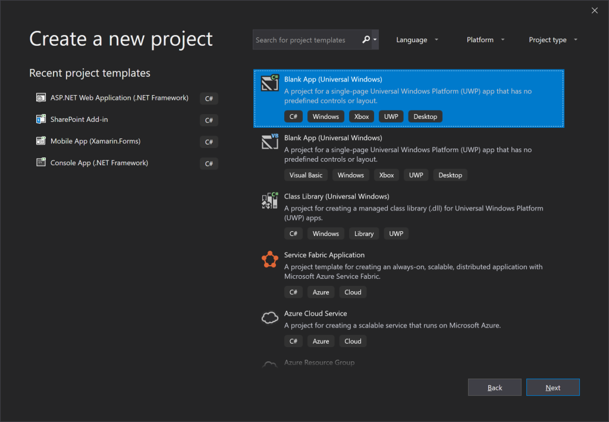
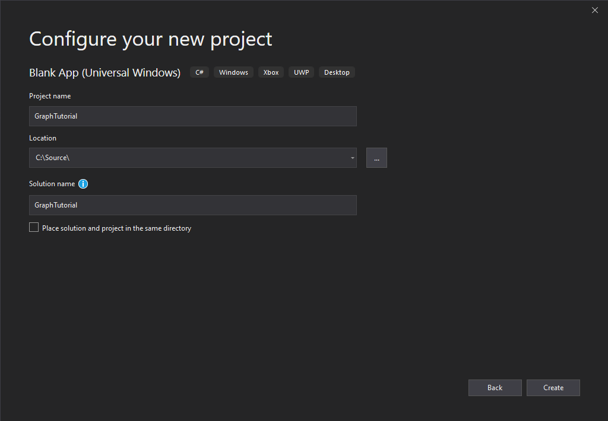
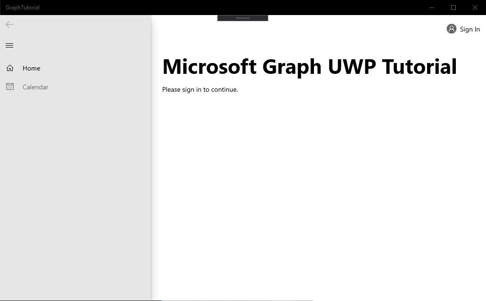

<!-- markdownlint-disable MD002 MD041 -->

In this section you'll create a new UWP app.

1. Open Visual Studio, and select **Create a new project**. Choose the **Blank App (Universal Windows)** option that uses C#, then select **Next**.

    

1. In the **Configure your new project** dialog, enter `GraphTutorial` in the **Project name** field and select **Create**.

    

    > [!IMPORTANT]
    > Ensure that you enter the exact same name for the Visual Studio Project that is specified in these lab instructions. The Visual Studio Project name becomes part of the namespace in the code. The code inside these instructions depends on the namespace matching the Visual Studio Project name specified in these instructions. If you use a different project name the code will not compile unless you adjust all the namespaces to match the Visual Studio Project name you enter when you create the project.

1. Select **OK**. In the **New Universal Windows Platform Project** dialog, ensure that the **Minimum version** is set to `Windows 10, Version 1809 (10.0; Build 17763)` or later and select **OK**.

## Install NuGet packages

Before moving on, install some additional NuGet packages that you will use later.

- [Microsoft.Toolkit.Uwp.Ui.Controls](https://www.nuget.org/packages/Microsoft.Toolkit.Uwp.Ui.Controls/) to add some UI controls for in-app notifications and loading indicators.
- [Microsoft.Toolkit.Uwp.Ui.Controls.DataGrid](https://www.nuget.org/packages/Microsoft.Toolkit.Uwp.Ui.Controls.DataGrid/) to display the information returned by Microsoft Graph.
- [Microsoft.Toolkit.Graph.Controls](https://www.nuget.org/packages/Microsoft.Toolkit.Graph.Controls) to handle login and access token retrieval.

1. Select **Tools > NuGet Package Manager > Package Manager Console**. In the Package Manager Console, enter the following commands.

    ```powershell
    Install-Package Microsoft.Toolkit.Uwp.Ui.Controls -Version 6.0.0
    Install-Package Microsoft.Toolkit.Uwp.Ui.Controls.DataGrid -Version 6.0.0
    Install-Package Microsoft.Toolkit.Graph.Controls -IncludePrerelease
    ```

## Design the app

In this section you'll create the UI for the app.

1. Start by adding an application-level variable to track authentication state. In Solution Explorer, expand **App.xaml** and open **App.xaml.cs**. Add the following property to the `App` class.

    ```csharp
    public bool IsAuthenticated { get; set; }
    ```

1. Define the layout for the main page. Open `MainPage.xaml` and replace its entire contents with the following.

    :::code language="xaml" source="../demo/GraphTutorial/MainPage.xaml" id="MainPageXamlSnippet":::

    This defines a basic [NavigationView](/uwp/api/windows.ui.xaml.controls.navigationview) with **Home** and **Calendar** navigation links to act as the main view of the app. It also adds a [LoginButton](https://github.com/windows-toolkit/Graph-Controls) control in the header of the view. That control will allow the user to sign in and out. The control isn't fully enabled yet, you will configure it in a later exercise.

1. Right-click the **graph-tutorial** project in Solution Explorer and select **Add > New Item...**. Choose **Blank Page**, enter `HomePage.xaml` in the **Name** field, and select **Add**. Replace the existing `<Grid>` element in the file with the following.

    :::code language="xaml" source="../demo/GraphTutorial/HomePage.xaml" id="HomePageGridSnippet" highlight="2-5":::

1. Expand **MainPage.xaml** in Solution Explorer and open `MainPage.xaml.cs`. Add the following function to the `MainPage` class to manage authentication state.

    :::code language="csharp" source="../demo/GraphTutorial/MainPage.xaml.cs" id="SetAuthStateSnippet":::

1. Add the following code to the `MainPage()` constructor **after** the `this.InitializeComponent();` line.

    ```csharp
    // Initialize auth state to false
    SetAuthState(false);

    // Configure MSAL provider
    // TEMPORARY
    MsalProvider.ClientId = "11111111-1111-1111-1111-111111111111";

    // Navigate to HomePage.xaml
    RootFrame.Navigate(typeof(HomePage));
    ```

    When the app first starts, it will initialize the authentication state to `false` and navigate to the home page.

1. Add the following event handler to load the requested page when the user selects an item from the navigation view.

    ```csharp
    private void NavView_ItemInvoked(NavigationView sender, NavigationViewItemInvokedEventArgs args)
    {
        var invokedItem = args.InvokedItem as string;

        switch (invokedItem.ToLower())
        {
            case "calendar":
                throw new NotImplementedException();
                break;
            case "home":
            default:
                RootFrame.Navigate(typeof(HomePage));
                break;
        }
    }
    ```

1. Save all of your changes, then press **F5** or select **Debug > Start Debugging** in Visual Studio.

    > [!NOTE]
    > Make sure you select the appropriate configuration for your machine (ARM, x64, x86).

    
