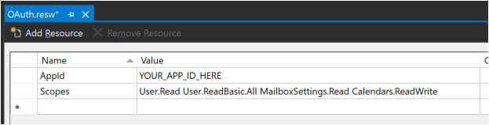
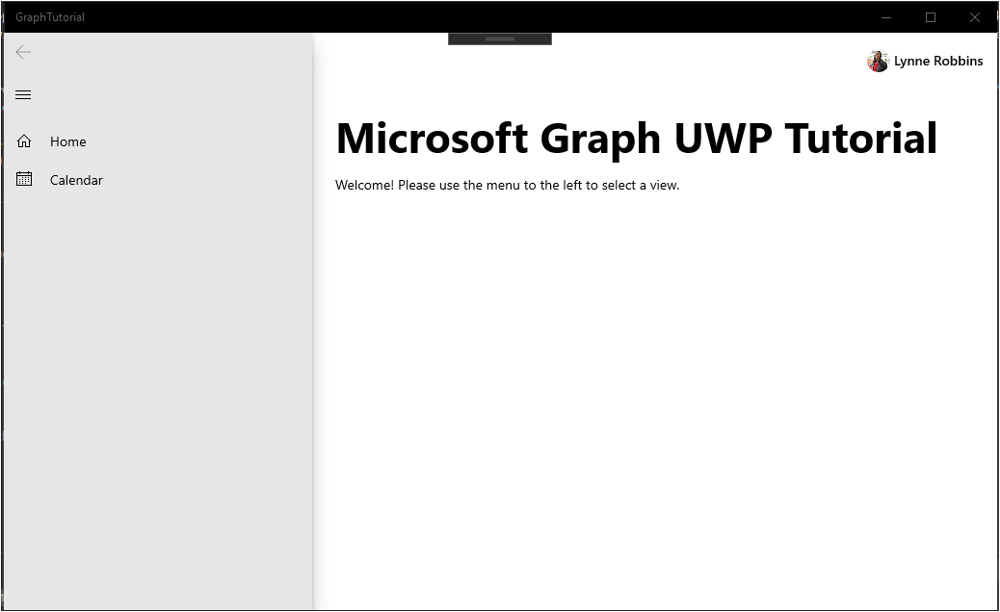

<!-- markdownlint-disable MD002 MD041 -->

In this exercise you will extend the application from the previous exercise to support authentication with Azure AD. This is required to obtain the necessary OAuth access token to call the Microsoft Graph. In this step you will integrate the [AadLogin](https://docs.microsoft.com/dotnet/api/microsoft.toolkit.uwp.ui.controls.graph.aadlogin?view=win-comm-toolkit-dotnet-stable) control from the [Windows Community Toolkit](https://github.com/Microsoft/WindowsCommunityToolkit) into the application.

Right-click the **graph-tutorial** project in Solution Explorer and choose **Add > New Item...**. Choose **Resources File (.resw)**, name the file `OAuth.resw` and choose **Add**. When the new file opens in Visual Studio, create two resources as follows.

- **Name:** `AppId`, **Value:** the app ID you generated in Application Registration Portal
- **Name:** `Scopes`, **Value:** `User.Read Calendars.Read`



> [!IMPORTANT]
> If you're using source control such as git, now would be a good time to exclude the `OAuth.resw` file from source control to avoid inadvertently leaking your app ID.

## Configure the AadLogin control

Start by adding code to read the values out of the resources file. Open `MainPage.xaml.cs` and add the following `using` statement to the top of the file.

```cs
using Microsoft.Toolkit.Services.MicrosoftGraph;
```

Replace the `RootFrame.Navigate(typeof(HomePage));` line with the following code.

```cs
// Load OAuth settings
var oauthSettings = Windows.ApplicationModel.Resources.ResourceLoader.GetForCurrentView("OAuth");
var appId = oauthSettings.GetString("AppId");
var scopes = oauthSettings.GetString("Scopes");

if (string.IsNullOrEmpty(appId) || string.IsNullOrEmpty(scopes))
{
    Notification.Show("Could not load OAuth Settings from resource file.");
}
else
{
    // Initialize Graph
    MicrosoftGraphService.Instance.AuthenticationModel = MicrosoftGraphEnums.AuthenticationModel.V2;
    MicrosoftGraphService.Instance.Initialize(appId,
        MicrosoftGraphEnums.ServicesToInitialize.UserProfile,
        scopes.Split(' '));

    // Navigate to HomePage.xaml
    RootFrame.Navigate(typeof(HomePage));
}
```

This code loads the settings from `OAuth.resw` and initializes the global instance of the `MicrosoftGraphService` with those values.

Now add an event handler for the `SignInCompleted` event on the `AadLogin` control. Open the `MainPage.xaml` file and replace the existing `<graphControls:AadLogin>` element with the following.

```xml
<graphControls:AadLogin x:Name="Login"
    HorizontalAlignment="Left"
    View="SmallProfilePhotoLeft"
    AllowSignInAsDifferentUser="False"
    SignInCompleted="Login_SignInCompleted"
    SignOutCompleted="Login_SignOutCompleted"
    />
```

Then add the following functions to the `MainPage` class in `MainPage.xaml.cs`.

```cs
private void Login_SignInCompleted(object sender, Microsoft.Toolkit.Uwp.UI.Controls.Graph.SignInEventArgs e)
{
    // Set the auth state
    SetAuthState(true);
    // Reload the home page
    RootFrame.Navigate(typeof(HomePage));
}

private void Login_SignOutCompleted(object sender, EventArgs e)
{
    // Set the auth state
    SetAuthState(false);
    // Reload the home page
    RootFrame.Navigate(typeof(HomePage));
}
```

Finally, in Solution Explorer, expand **HomePage.xaml** and open `HomePage.xaml.cs`. Add the following code after the `this.InitializeComponent();` line.

```cs
if ((App.Current as App).IsAuthenticated)
{
    HomePageMessage.Text = "Welcome! Please use the menu to the left to select a view.";
}
```

Restart the app and click the **Sign In** control at the top of the app. Once you've signed in, the UI should change to indicate that you've successfully signed-in.



> [!NOTE]
> The `AadLogin` control implements the logic of storing and refreshing the access token for you. The tokens are stored in secure storage and refreshed as needed.