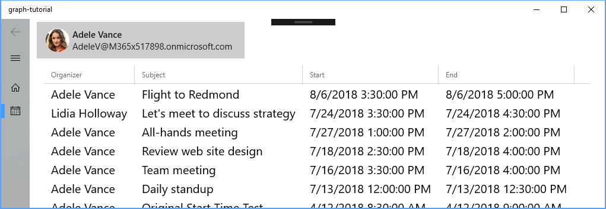

<!-- markdownlint-disable MD002 MD041 -->

In this exercise you will incorporate the Microsoft Graph into the application. For this application, you will use the [Microsoft Graph Client Library for .NET](https://github.com/microsoftgraph/msgraph-sdk-dotnet) to make calls to Microsoft Graph.

## Get calendar events from Outlook

Start by adding a new page for the calendar view. Right-click the **graph-tutorial** project in Solution Explorer and choose **Add > New Item...**. Choose **Blank Page**, enter `CalendarPage.xaml` in the **Name** field, and choose **Add**.

Open `CalendarPage.xaml` and add the following line inside the existing `<Grid>` element.

```xml
<TextBlock x:Name="Events" TextWrapping="Wrap"/>
```

Open `CalendarPage.xaml.cs` and add the following `using` statements at the top of the file.

```cs
using Microsoft.Toolkit.Services.MicrosoftGraph;
using Microsoft.Toolkit.Uwp.UI.Controls;
using Newtonsoft.Json;
```

Then add the following functions to the `CalendarPage` class.

```cs
private void ShowNotification(string message)
{
    // Get the main page that contains the InAppNotification
    var mainPage = (Window.Current.Content as Frame).Content as MainPage;

    // Get the notification control
    var notification = mainPage.FindName("Notification") as InAppNotification;

    notification.Show(message);
}

protected override async void OnNavigatedTo(NavigationEventArgs e)
{
    // Get the Graph client from the service
    var graphClient = MicrosoftGraphService.Instance.GraphProvider;

    try
    {
        // Get the events
        var events = await graphClient.Me.Events.Request()
            .Select("subject,organizer,start,end")
            .OrderBy("createdDateTime DESC")
            .GetAsync();

        // TEMPORARY: Show the results as JSON
        Events.Text = JsonConvert.SerializeObject(events.CurrentPage);
    }
    catch(Microsoft.Graph.ServiceException ex)
    {
        ShowNotification($"Exception getting events: {ex.Message}");
    }

    base.OnNavigatedTo(e);
}
```

Consider with the code in `OnNavigatedTo` is doing.

- The URL that will be called is `/v1.0/me/events`.
- The `Select` function limits the fields returned for each events to just those the view will actually use.
- The `OrderBy` function sorts the results by the date and time they were created, with the most recent item being first.

Run the app, sign in, and click the **Calendar** navigation item in the left-hand menu. You should see a JSON dump of the events on the user's calendar.

## Display the results

Now you can replace the JSON dump with something to display the results in a user-friendly manner. Replace the entire contents of `CalendarPage.xaml` with the following.

```xml
<Page
    x:Class="graph_tutorial.CalendarPage"
    xmlns="http://schemas.microsoft.com/winfx/2006/xaml/presentation"
    xmlns:x="http://schemas.microsoft.com/winfx/2006/xaml"
    xmlns:local="using:graph_tutorial"
    xmlns:d="http://schemas.microsoft.com/expression/blend/2008"
    xmlns:mc="http://schemas.openxmlformats.org/markup-compatibility/2006"
    xmlns:controls="using:Microsoft.Toolkit.Uwp.UI.Controls"
    mc:Ignorable="d"
    Background="{ThemeResource ApplicationPageBackgroundThemeBrush}">

    <Grid>
        <controls:DataGrid x:Name="EventList" Grid.Row="1"
                AutoGenerateColumns="False">
            <controls:DataGrid.Columns>
                <controls:DataGridTextColumn
                        Header="Organizer"
                        Width="SizeToCells"
                        Binding="{Binding Organizer.EmailAddress.Name}"
                        FontSize="20" />
                <controls:DataGridTextColumn
                        Header="Subject"
                        Width="SizeToCells"
                        Binding="{Binding Subject}"
                        FontSize="20" />
                <controls:DataGridTextColumn
                        Header="Start"
                        Width="SizeToCells"
                        Binding="{Binding Start.DateTime}"
                        FontSize="20" />
                <controls:DataGridTextColumn
                        Header="End"
                        Width="SizeToCells"
                        Binding="{Binding End.DateTime}"
                        FontSize="20" />
            </controls:DataGrid.Columns>
        </controls:DataGrid>
    </Grid>
</Page>
```

This replaces the `TextBlock` with a `DataGrid`. Now open `CalendarPage.xaml.cs` and replace the `Events.Text = JsonConvert.SerializeObject(events.CurrentPage);` line with the following.

```cs
EventList.ItemsSource = events.CurrentPage.ToList();
```

If you run the app now and select the calendar, you should get a list of events in a data grid. However, the **Start** and **End** values are displayed in a non-user-friendly manner. You can control how those values are displayed by using a [value converter](https://docs.microsoft.com/uwp/api/Windows.UI.Xaml.Data.IValueConverter).

Right-click the **graph-tutorial** project in Solution Explorer and choose **Add > Class...**. Name the class `GraphDateTimeTimeZoneConverter.cs` and choose **Add**. Replace the entire contents of the file with the following.

```cs
using Microsoft.Graph;
using System;

namespace graph_tutorial
{
    class GraphDateTimeTimeZoneConverter : Windows.UI.Xaml.Data.IValueConverter
    {
        public object Convert(object value, Type targetType, object parameter, string language)
        {
            DateTimeTimeZone date = value as DateTimeTimeZone;

            if (date != null)
            {
                // Resolve the time zone
                var timezone = TimeZoneInfo.FindSystemTimeZoneById(date.TimeZone);
                // Parse method assumes local time, which may not be the case
                var parsedDateAsLocal = DateTimeOffset.Parse(date.DateTime);
                // Determine the offset from UTC time for the specific date
                // Making this call adjusts for DST as appropriate
                var tzOffset = timezone.GetUtcOffset(parsedDateAsLocal.DateTime);
                // Create a new DateTimeOffset with the specific offset from UTC
                var correctedDate = new DateTimeOffset(parsedDateAsLocal.DateTime, tzOffset);
                // Return the local date time string
                return correctedDate.LocalDateTime.ToString();
            }

            return string.Empty;
        }

        public object ConvertBack(object value, Type targetType, object parameter, string language)
        {
            throw new NotImplementedException();
        }
    }
}
```

This code takes the [dateTimeTimeZone](https://developer.microsoft.com/en-us/graph/docs/api-reference/v1.0/resources/datetimetimezone) structure returned by Microsoft Graph and parses it into a `DateTimeOffset` object. It then converts the value into the user's time zone and returns the formatted value.

Open `CalendarPage.xaml` and add the following **before** the `<Grid>` element.

```xml
<Page.Resources>
    <local:GraphDateTimeTimeZoneConverter x:Key="DateTimeTimeZoneValueConverter" />
</Page.Resources>
```

Then, replace the `Binding="{Binding Start.DateTime}"` line with the following.

```xml
Binding="{Binding Start, Converter={StaticResource DateTimeTimeZoneValueConverter}}"
```

Replace the `Binding="{Binding End.DateTime}"` line with the following.

```xml
Binding="{Binding End, Converter={StaticResource DateTimeTimeZoneValueConverter}}"
```

Run the app, sign in, and click the **Calendar** navigation item. You should see the list of events with the **Start** and **End** values formatted.

